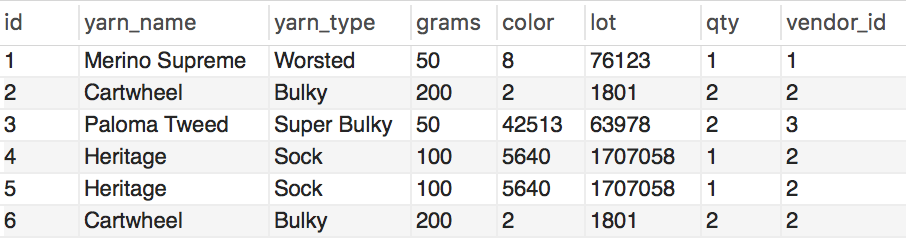

# Duplicates

## Part 1

* How do you locate a duplicate record with one field? Using the table below, write a query to demonstrate.

  * Yarn table with duplicates:

    
SELECT yarn_name, 
COUNT * FROM duplicated_yarn 
GROUP BY yarn_name HAVING COUNT * 35 m> 1
## Part 2

* How do you find duplicate records using more than one field? Using the table from Part 1, write a query to demonstrate.
SELECT yarn_name, COUNT * FROM duplicated_yarn GROUP BY yarn_name HAVING COUNT * > 1